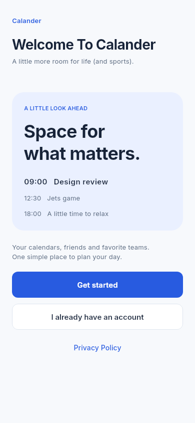
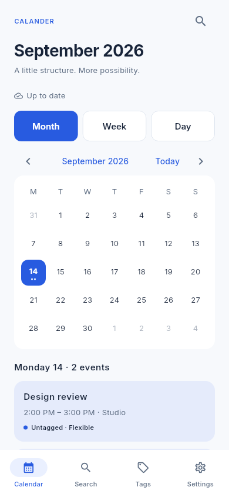
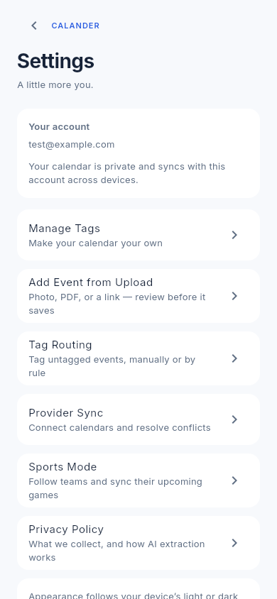
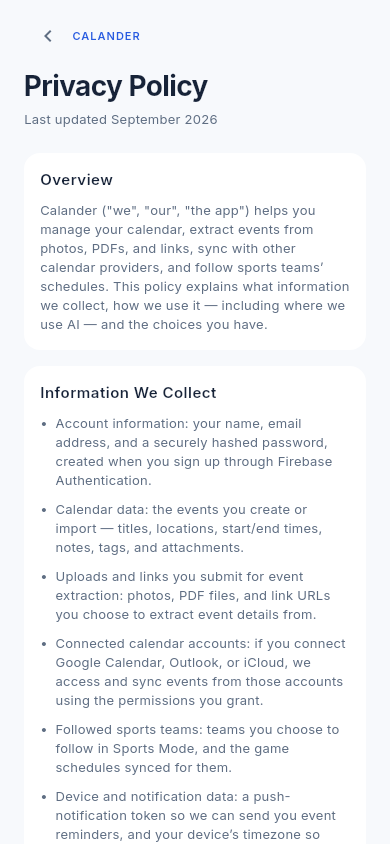
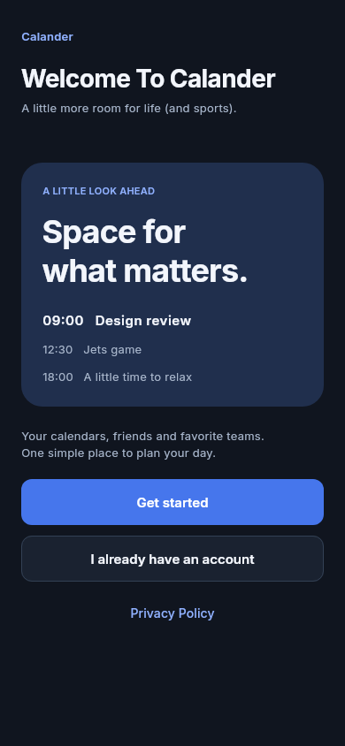
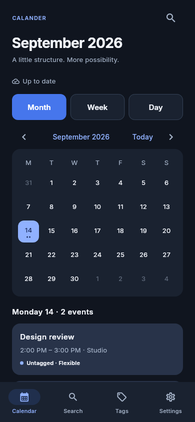
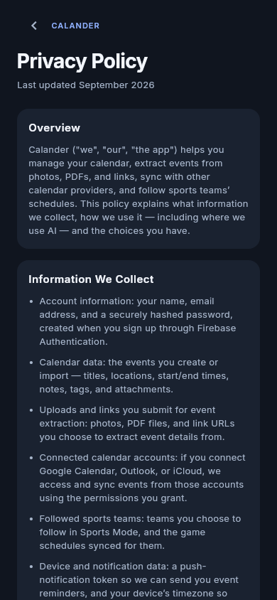
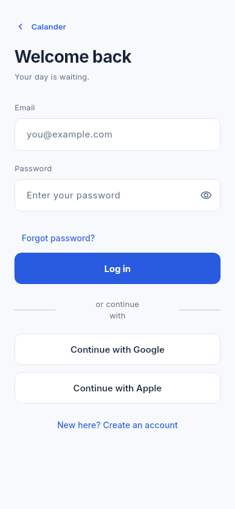

# Calander

A mobile-first Flutter calendar app: your own events, calendars synced in
from Google/Outlook/iCloud, sports schedules for the teams you follow, and
events extracted straight from a photo, PDF, or link — all in one place.

|                                  |                                  |
| -------------------------------- | -------------------------------- |
|  |  |
|  |  |

<details>
<summary>Dark mode</summary>

|                                  |                                  |
| -------------------------------- | -------------------------------- |
|  |  |
|  |  |

</details>

## What's here

- **[`calander/`](calander/)** — the Flutter app itself (calendar, auth,
  tags, upload extraction, provider sync, sports mode). See
  [`calander/README.md`](calander/README.md) for the full, per-feature
  technical writeup.
- **[`functions/`](functions/)** — Firebase Cloud Functions: `extractEvent`
  (turns an uploaded photo/PDF/link into a proposed event via Anthropic's
  Claude API) and `pollSportsEvents` (keeps followed teams' games synced).
- **[`scripts/sports_poller/`](scripts/sports_poller/)** — a Python
  equivalent of the sports poller that runs on a free GitHub Actions cron,
  so sports sync works without upgrading the Firebase project's billing
  plan.
- **[`chrome-extension/`](chrome-extension/)** — a companion extension for
  capturing events from the browser.
- **`firestore.rules`, `storage.rules`** — the security rules for the live
  Firebase project. See [`DEPLOYMENT.md`](DEPLOYMENT.md) for how a change
  to these actually reaches production.

## Features

- Email/password auth with email verification, password reset, and
  per-device session handling.
- Month/Week/Day calendar views, search, and full event CRUD — location,
  notes, tags, all-day/multi-day, Fixed/Flexible importance.
- **Tags** you define, plus **Tag Routing** rules that auto-tag untagged
  events (a user's own tag choice always wins and is never overwritten).
- **Add Event from Upload** — a photo, PDF, or link becomes a proposed
  event via AI extraction, which you review and edit before anything
  saves.
- **Provider Sync** — pull events in from Google Calendar, Outlook, or
  iCloud, with cross-source conflict detection (Keep original / Keep new
  / Keep both — never an automatic merge).
- **Sports Mode** — follow teams and get their upcoming games synced onto
  your calendar automatically, with no direct API calls from the app
  itself.
- Local + push notification reminders per event.
- Light and dark themes that follow the device setting.

## Privacy

Calander collects only what each feature needs, and is explicit about the
one place AI is involved (event extraction from an upload). Read the full
policy:

- **In the app**: Settings → Privacy Policy (also linked from the welcome
  screen, before you create an account).
- **On GitHub**: [`PRIVACY.md`](PRIVACY.md).

## Getting started

```sh
cd calander
flutter pub get
flutter run -d chrome
```

See [`calander/README.md`](calander/README.md) for platform-specific setup
(Android/iOS/Windows), the full test suite, and how each feature is wired
to Firebase.

## Screenshots

The images above are real renders of the app — generated by
`test/widget_test.dart`'s preview tests (`flutter test
test/widget_test.dart`), which drive the actual widget tree with fake
auth/Firestore and capture it to PNG via `RepaintBoundary.toImage()`, no
browser or emulator required. Output lands in `calander/build/auth-previews/`
(gitignored); the copies under [`docs/screenshots/`](docs/screenshots/)
are what this README embeds, refreshed by hand when a screen's design
changes meaningfully.
